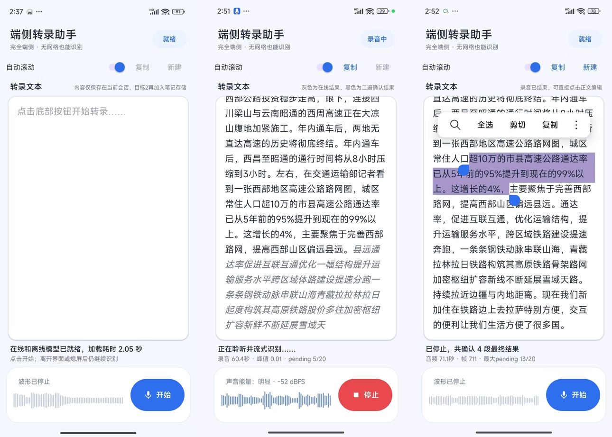

# On-device Voice Transcription Assistant

[简体中文](README.md) | [English](README_EN.md)

An Android demo for on-device, streaming speech transcription. It shows low-latency online hypotheses while recording, then runs SenseVoice as a local second pass when each speech segment ends. Audio and recognition stay on the device by default.

> Status: v0.1.0 release candidate  
> Devices: Android 8.0 (API 26) or later, arm64-v8a  
> Scope: technical validation and open-source demo, not a production transcription product

## Download the APK

- [Download the latest release](https://github.com/dlv2008/voice-input-demo/releases/latest)
- Recommended asset name: `voice-input-demo-v0.1.0-arm64-v8a.apk`
- Verify the SHA-256 value published with the release before installing.

The APK is signed with the maintainer's own certificate. Android may warn about installing an app from an unknown source. Download it only from this project's GitHub Releases page.

## Screenshots


## Features

- 16 kHz mono PCM microphone capture;
- streaming Online Partial results during recording;
- local SenseVoice second-pass recognition at an endpoint or safety boundary;
- gray online hypotheses/fallbacks and black second-pass confirmed text;
- replacing Partial events, appended Final events, and a continuous paragraph view;
- conservative filtering of blanks, punctuation-only output, model markers, and very short filler sounds;
- PCM peak and RMS waveform feedback;
- a started and bound foreground microphone Service;
- a partial WakeLock for continued processing while the screen is off;
- auto-scroll, copy, new-document, and post-stop editing controls;
- no application-level total session limit; 20 seconds is a segment safety boundary, not a recording limit;
- no cloud ASR dependency and no network permission in the current Manifest.

## How it works

~~~mermaid
flowchart TD
    MIC["Microphone PCM"] --> REC["StreamPcmRecorder"]
    REC --> ONLINE["Streaming Zipformer"]
    ONLINE -->|"Partial"| UI["Gray live text"]
    ONLINE -->|"Endpoint / 20 s boundary"| SECOND["SenseVoice second pass"]
    SECOND -->|"Final"| DOC["Transcript document"]
    DOC --> UI2["Black confirmed text"]
~~~

The online model provides responsive feedback. SenseVoice performs a second pass after a segment closes. Both results are aligned by the same `segmentId`.

- [Architecture and technical notes (English)](docs/ARCHITECTURE.en.md)
- [架构与技术说明（中文）](docs/ARCHITECTURE.zh-CN.md)

## Technology

| Area | Current choice |
|---|---|
| UI | Kotlin + Android XML Views + Material Components |
| Audio | AudioRecord, 16 kHz, mono, PCM |
| ASR runtime | [sherpa-onnx 1.13.4](https://github.com/k2-fsa/sherpa-onnx/releases/tag/v1.13.4) |
| Streaming model | [Streaming Zipformer 14M, Chinese](https://k2-fsa.github.io/sherpa/onnx/pretrained_models/online-transducer/zipformer-transducer-models.html#csukuangfj-sherpa-onnx-streaming-zipformer-zh-14m-2023-02-23-chinese) |
| Second-pass model | [SenseVoice int8, Chinese/English/Japanese/Korean/Cantonese](https://k2-fsa.github.io/sherpa/onnx/sense-voice/pretrained.html) |
| Android | compileSdk / targetSdk 35, minSdk 26 |
| ABI | arm64-v8a |
| Concurrency | Single ASR worker + bounded Semaphore queue |
| Background capture | Foreground microphone Service + partial WakeLock |

## Build from source

### 1. Prerequisites

- [Android Studio](https://developer.android.com/studio)
- Android SDK Platform 35
- Android SDK Build-Tools 35.0.0 or a compatible stable version
- Android SDK Platform-Tools
- Android Studio's bundled JBR
- Git

### 2. Clone

~~~powershell
git clone https://github.com/dlv2008/voice-input-demo.git
Set-Location voice-input-demo
~~~

### 3. Create the local dependency directories

Git does not preserve empty directories. The AAR and model files are also excluded by `.gitignore`, so create the directories after cloning.

Windows PowerShell:

```powershell
New-Item -ItemType Directory -Force app\libs | Out-Null
New-Item -ItemType Directory -Force app\src\main\assets | Out-Null
```

Linux, macOS, or WSL:

```bash
mkdir -p app/libs
mkdir -p app/src/main/assets
```

Expected base layout:

```text
voice-input-demo/
└── app/
    ├── libs/
    └── src/
        └── main/
            └── assets/
```

### 4. Add the sherpa-onnx AAR

Download:

- [sherpa-onnx-static-link-onnxruntime-1.13.4.aar](https://github.com/k2-fsa/sherpa-onnx/releases/download/v1.13.4/sherpa-onnx-static-link-onnxruntime-1.13.4.aar)

Copy it to:

```text
app/libs/sherpa-onnx-static-link-onnxruntime-1.13.4.aar
```

Do not rename the file. `app/build.gradle.kts` references this exact name:

```kotlin
implementation(
    files("libs/sherpa-onnx-static-link-onnxruntime-1.13.4.aar")
)
```

The AAR provides the sherpa-onnx Kotlin/Java API, JNI libraries, and ONNX Runtime support.

### 5. Add the speech models

The project uses two model packages.

#### 5.1 Streaming online model

Used to produce the live gray transcription while recording:

- [Streaming Zipformer 14M Chinese model](https://github.com/k2-fsa/sherpa-onnx/releases/download/asr-models/sherpa-onnx-streaming-zipformer-zh-14M-2023-02-23.tar.bz2)

#### 5.2 SenseVoice second-pass model

Used to produce the black confirmed text after a speech segment closes:

- [SenseVoice int8 model](https://github.com/k2-fsa/sherpa-onnx/releases/download/asr-models/sherpa-onnx-sense-voice-zh-en-ja-ko-yue-int8-2024-07-17.tar.bz2)

Extract both archives with 7-Zip, `tar`, or another tool supporting `.tar.bz2`. Copy the extracted directories into:

```text
app/src/main/assets/
```

From WSL, Linux, or macOS, you can run:

```bash
mkdir -p app/src/main/assets
cd app/src/main/assets

wget https://github.com/k2-fsa/sherpa-onnx/releases/download/asr-models/sherpa-onnx-streaming-zipformer-zh-14M-2023-02-23.tar.bz2
tar -xjf sherpa-onnx-streaming-zipformer-zh-14M-2023-02-23.tar.bz2
rm sherpa-onnx-streaming-zipformer-zh-14M-2023-02-23.tar.bz2

wget https://github.com/k2-fsa/sherpa-onnx/releases/download/asr-models/sherpa-onnx-sense-voice-zh-en-ja-ko-yue-int8-2024-07-17.tar.bz2
tar -xjf sherpa-onnx-sense-voice-zh-en-ja-ko-yue-int8-2024-07-17.tar.bz2
rm sherpa-onnx-sense-voice-zh-en-ja-ko-yue-int8-2024-07-17.tar.bz2
```

### 6. Verify the final layout

The following files must exist:

```text
app/
├── libs/
│   └── sherpa-onnx-static-link-onnxruntime-1.13.4.aar
└── src/
    └── main/
        └── assets/
            ├── sherpa-onnx-streaming-zipformer-zh-14M-2023-02-23/
            │   ├── encoder-epoch-99-avg-1.int8.onnx
            │   ├── decoder-epoch-99-avg-1.onnx
            │   ├── joiner-epoch-99-avg-1.int8.onnx
            │   └── tokens.txt
            └── sherpa-onnx-sense-voice-zh-en-ja-ko-yue-int8-2024-07-17/
                ├── model.int8.onnx
                └── tokens.txt
```

Avoid an extra nested directory such as:

```text
assets/model-directory/model-directory/model.int8.onnx
```

The application looks up the models using the exact directory names shown above.

### 7. What is `tokens.txt`?

`tokens.txt` is the vocabulary that maps model output token IDs to characters, words, or subwords.

Each model package has its own `tokens.txt`:

```text
Streaming Zipformer
└── tokens.txt

SenseVoice
└── tokens.txt
```

Important rules:

- use the `tokens.txt` included in the same archive as the ONNX model;
- do not share one token file between the two models;
- do not replace it with a token file from another model version;
- a missing or incompatible token file may cause initialization failure or incorrect text output.

Code mapping:

```text
AndroidOnlineAsrEngine
→ Streaming Zipformer tokens.txt

AndroidVoiceCore
→ SenseVoice tokens.txt
```

### 8. Why are these files excluded from Git?

The AAR and model files are excluded because:

1. model files are large and would make cloning and updating the repository expensive;
2. normal GitHub repositories have a 100 MiB per-file limit;
3. the AAR and models are third-party artifacts with their own licenses;
4. downloading from official sources preserves clear provenance and version information;
5. model upgrades should not permanently expand the Git history.

Do not force-add these files with `git add -f`.

The APK published on GitHub Releases already contains the runtime libraries and models required by end users. Only developers building from source need to download these files separately.

### 9. Build and run

1. Open the repository root in Android Studio.
2. Wait for Gradle Sync to complete.
3. Connect an arm64-v8a Android device over USB.
4. Authorize USB debugging on the device.
5. Select the `app` run configuration.
6. Click Run.
7. Grant microphone and notification permissions on first launch.

Command-line verification:

```powershell
.\gradlew.bat testDebugUnitTest
.\gradlew.bat assembleDebug
```

The debug APK is normally written to:

```text
app/build/outputs/apk/debug/app-debug.apk
```

The current project only builds:

```text
arm64-v8a
```

It cannot run on x86, x86_64, or 32-bit ARM-only devices and emulators.

## Transcript semantics

| Appearance | Meaning |
|---|---|
| Gray italic text | Current Online Partial; later hypotheses replace it |
| Black text | Stable Final produced by a successful SenseVoice second pass |
| Stable gray text | Online fallback retained when the second pass fails or is empty |
| STOPPING | Draining PCM, finalizing the tail segment, and releasing the Stream |

Black means “second-pass processed,” not “guaranteed correct.” Proper nouns, numbers, English abbreviations, and noisy audio may still require manual editing.

## Permissions and privacy

| Permission | Purpose |
|---|---|
| RECORD_AUDIO | Capture microphone PCM |
| POST_NOTIFICATIONS | Show the foreground-service notification on Android 13+ |
| FOREGROUND_SERVICE | Run continued recording |
| FOREGROUND_SERVICE_MICROPHONE | Declare the microphone FGS type |
| WAKE_LOCK | Keep required audio processing active with the screen off |

The current recognition pipeline runs on-device and does not upload recordings. Revisit this privacy statement before adding LLM, synchronization, analytics, or remote storage features.

## Known limitations

- The current streaming Zipformer model mainly targets Chinese; mixed English and proper nouns are limited.
- There is no independent VAD yet; segmentation relies on the online endpoint and a 20-second safety boundary.
- No persistent audio/note storage, database, tags, or full-text search.
- No speaker diarization or multi-speaker labels.
- No homophone dictionary, domain hotwords, or LLM context correction.
- arm64-v8a only.
- Persistence of manual edits depends on the current implementation; copy important text before closing the app.

## Roadmap

- [ ] VAD and more natural boundaries;
- [ ] persistent sessions and audio;
- [ ] voice-note list, tags, editing, sharing, and merging;
- [ ] manageable meeting, diary, and technical-note templates;
- [ ] optional LLM correction, punctuation, summarization, and structuring;
- [ ] speaker diarization and labels;
- [ ] performance benchmarks, regression tests, and broader device coverage;
- [ ] a platform-neutral core boundary for a future iOS implementation.

## Contributing

1. Fork the repository and create a branch from `main`.
2. Preserve the resource rule: reuse Recognizers and manage Streams per session.
3. Never load models or decode on the UI thread.
4. Do not silently drop PCM; backpressure must be observable and fail explicitly.
5. Run unit tests and a physical-device regression before submitting.
6. In your pull request, include device model, Android version, test phrases, and results.

## License

[Apache License 2.0](LICENSE)


## Acknowledgements

- [k2-fsa/sherpa-onnx](https://github.com/k2-fsa/sherpa-onnx)
- [SenseVoice](https://github.com/FunAudioLLM/SenseVoice)
- [Android Developers](https://developer.android.com/)

## Maintainer documentation

- [Pre-release checklist (Chinese)](docs/RELEASE_CHECKLIST.zh-CN.md)
- [Release notes template](docs/RELEASE_NOTES_TEMPLATE.md)
